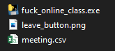
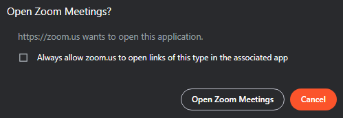
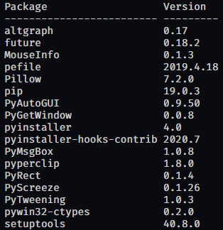

# Fuck-Online-Class

আপনি কি অনলাইন ক্লাস নিয়ে চিন্তিতো? টানা ৪ মাস চিল করে এখন ক্লাস এর প্যারা নিতে পারছেন না? ঘুম থেকে উঠতে সমস্যা হচ্ছে? কোনো চিন্তা নেই ভাই হ্যা শুধু মাত্র আপনার জন্যই এসে গেলো "Fuck Online Class"! আপনার যন্ত্রণাদায়ক অনলাইন ক্লাসগুলো থেকে মুক্তি পান এখনি। 

## প্রানপ্রিয় উইন্ডোজ ব্যবহারকারী ভাইদের জন্য 

ভাই জানি আপনারা একটু প্যারা নিতে কম পছন্দ করেন। এই সিদ্ধান্তের জন্য আপনাদেরকে সাধুবাদ জানাই। জীবনতো আপনাদেরই। এইজন্য আপনাদের প্যারা আরো কম করতে runnable file বানিয়ে দিয়ে দেয়া হয়েছে। fuck-online-class(windows).zip ফাইলটি ডাউনলোড করুন। হালকা প্যারা নিয়ে unzip করুন। একটু বিশ্রাম নিন, পানি খান। এখন meeting.csv নামের যেই ফাইলটি দেখতে পারছেন সেটাতে নিজের ক্লাস এর সময়সূচী সঠিক ফর্মা মেনে টুকে নিন। এবার fuck_online_class.exe ফাইলটি কষ্ট করে ডাবল ক্লিক করে চালু করুন। আর বসে বসে খেলা দেখুন। 

## যেই ভাইয়েরা আলগা প্যারা নিতে পছন্দ করেন তাদের জন্য

### পূর্বাহ্নে অবশ্য পূরণীয়

* Python 3 (3.5-3.6 হইলে ভালো হয়)
* pip

### যেভাবে বানাবেন 

* আসুন দাদাভাই dependencyগুলো ভরে নেই 
```
pip install -r requirements.txt
```

* এবার এটাকে বানাবো  
```
pyinstaller --onfile -c fuck_online_class.py
```

* দরকারি ফাইলগুলো জায়গা মতো ভরি  
```
cp leave_button.png dist
cp meeting.csv dist
```

* এখন meeting.csv নামের যেই ফাইলটি দেখতে পারছেন সেটাতে নিজের ক্লাস এর সময়সূচী সঠিক ফর্মা মেনে টুকে নিন। এবার fuck_online_class.exe ফাইলটি কষ্ট করে ডাবল ক্লিক করে চালু করুন। আর বসে বসে খেলা দেখুন। 

## meeting.csv ফাইলের ফর্মা

ভাই বিশেষ অনুরোধ থাকবে এই ফাইলের খোমার সাথে বিনাকারণে ফষ্টি-নষ্টি করবেন না। ইহা একটি comma separated file। একটা লাইনে প্রথমে zoom meeting এর লিঙ্ক রাখুন, কমা দিন। এরপর ক্লাসের শুরুর সময় 24 HRs ফরমেটে HH:MM এই রূপে লিখুন, কমা দিন। এরপর ক্লাসের শেষের সময় 24 HRs ফরমেটে HH:MM এই রূপে লিখুন। দোয়া করে বিশেষ উদারতা দেখিয়ে কমার চিপায়-চাপায় space বা ফাঁকা চিহ্ন দেয়া থেকে বিরত থাকুন।

উদাহরণ:
```
https://zoom.us/j/abc?pwd=xyz,08:00,08:50
https://zoom.us/j/pqr?pwd=def,09:00,09:50
```


## কিছু কথা ও সংবিধিবদ্ধ সতর্কীকরণ 

* সব ঠিক-ঠাক মতো করলে *dist* ফোল্ডারের  খোমা হবে নিচের ছবির মতো 




* এই মালটি ব্যবহার করার আগে zoom link এ গেলে ব্রাউজারে যেই নিচের ছবির মতো pop-up টি আসে সেটাতে *Always allow zoom.us to open links of this type in the associated app* অপশনটিতে টিক চিহ্ন দেই এবং এরপর **Open Zoom Meetings** বাটনটিতে চাপ প্রয়োগ করি।



* বানানোর আগে মশলা-পাতি লোড করতে যেন না ভুলে যাই



* অনেক খিচ খেয়ে কোডটি লিখা হয়েছে যদি কোনো কারণে না চলে বা আপনার পছন্দ না হয় নিজ দায়িত্বে ঠিক করে নিবেন।